  
  
    
  
  

    

  

    <b>Cedra-shop</b> redéfinit la distribution de matériel électrique grâce à une architecture technologique de pointe. 
    Nous construisons une plateforme e-commerce résiliente, scalable et propulsée par l'IA.
  

   

  

    
    
    
  

 

 

 

## Architecture Système

Notre infrastructure est conçue autour d'une architecture **Microservices orientée événements**. Nous adaptons une approche polyglotte pour tirer parti des meilleures performances de chaque technologie, du frontend jusqu'à l'orchestration des données.

```mermaid
%%{init: {'theme': 'dark', 'themeVariables': { 'background': 'transparent', 'primaryColor': '#0d1117', 'primaryBorderColor': '#d32f2f', 'lineColor': '#8b949e', 'textColor': '#c9d1d9', 'fontFamily': 'Helvetica'}}}%%
flowchart LR
    subgraph Clients ["📱 Apps & Web"]
        direction TB
        App("Cedra App<br/><i>Dart</i>")
        Web("Cedra Web<br/><i>TypeScript</i>")
    end

    Gateway{{"⚡ Cedra Gateway<br/><i>Traefik</i>"}}

    subgraph Core ["🛒 E-Commerce & Core"]
        direction TB
        Temporal(["⏳ Temporal<br/><i>Go</i>"])
        Auth(["🔒 Auth<br/><i>TS</i>"])
        Commerce(["🛍️ Commerce<br/><i>Go</i>"])
        Inv(["📦 Inventory<br/><i>Go</i>"])
        Order(["🧾 Order<br/><i>Rust</i>"])
        Payment(["💳 Payment<br/><i>Go</i>"])
    end

    subgraph DataCom ["🧠 Data, Finance & Marketing"]
        direction TB
        Finance(["📊 Finance<br/><i>Rust</i>"])
        Analytics(["📈 Analytics<br/><i>Go</i>"])
        AI(["🧠 AI Engine<br/><i>Python</i>"])
        Audit(["📜 Audit<br/><i>Go</i>"])
        Marketing(["🎯 Marketing<br/><i>TS</i>"])
        Mail(["📧 Mail<br/><i>TS</i>"])
    end

    subgraph FastLayer ["⚡ Infra Layer"]
        direction TB
        Cache(["⚡ Cache<br/><i>Go</i>"])
        Realtime(["🚀 Realtime<br/><i>Go</i>"])
        B2B(["🤝 B2B<br/><i>Java</i>"])
    end

    App --> Gateway
    Web --> Gateway

    Gateway --> Core
    Gateway --> DataCom
    Gateway --> FastLayer

    Commerce -.->|Inv. Check| Inv
    Commerce -.->|Create| Order
    Order -.->|Process| Payment
    Finance -.->|Logs| Audit

    classDef nodes fill:#161b22,stroke:#d32f2f,stroke-width:2px,color:#ffffff,border-radius:6px
    classDef gateway fill:#d32f2f,stroke:#161b22,stroke-width:2px,color:#ffffff,border-radius:6px
    classDef cluster fill:transparent,stroke:#30363d,stroke-width:2px,color:#8b949e,border-radius:8px
    
    class App,Web,Auth,Commerce,Inv,Order,Payment,Finance,Analytics,AI,Audit,Marketing,Mail,Realtime,Temporal,Cache,B2B nodes;
    class Gateway gateway;
    class Clients,Core,DataCom,FastLayer cluster;
```

 

  

 

## 🛠 Stack Technique

Nous croyons en une approche **Polyglotte**. Chaque microservice est écrit dans le langage le plus adapté à ses contraintes de performance et de résilience.

  
  <h3>📱 Frontend & Mobile</h3>
  

    
    
    
    
  

  <i>Applications natives iOS/Android fluides & Dashboard Web réactif.</i>
  
    

  <h3>⚡ Core Backend</h3>
  

    
    
    
    
  

  <i>Logique métier ultra-rapide (Go) et sécurité mémoire sans compromis pour les commandes (Rust).</i>

    

  <h3>🧠 Data & IA</h3>
  

    
    
    
    
  

  <i>Modèles prédictifs et moteurs de recommandation hyper-personnalisés en temps réel.</i>

    

  <h3>⚙️ Infrastructure (On-Premise)</h3>
  

    
    
    
    
  

  <i>Orchestration légère et résiliente via Nomad, Streaming d'events (Kafka) et Caching distribué ultra-rapide (Valkey).</i>

 

## 🚀 Rejoignez l'équipe d'Ingénierie

**Cedra-shop** ne cherche pas de simples exécutants, nous cherchons des **ingénieurs passionnés** par la complexité, la performance brute et l'architecture distribuée à grande échelle.

 

  <h3>💼 Nos Défis & Postes Ouverts</h3>
  
   

  <table width="100%" style="text-align: left;">
    <tr align="center">
      <td width="50%">
        <h4>🎯 Défis Techniques</h4>
        <ul align="left">
          <li><b>Consistance Distribuée</b> : Implémentation de Saga patterns via Temporal.</li>
          <li><b>Micro-optimisations</b> : Repousser les limites de Rust pour la finance.</li>
          <li><b>MLOps Temps-Réel</b> : Scaler l'inférence de nos réseaux de neurones.</li>
          <li><b>Observabilité Massive</b> : Tracing distribué pour milliers de reqs/sec.</li>
        </ul>
      </td>
      <td width="50%">
        <h4>🔥 Postes à Pourvoir</h4>
        <ul align="left">
          <li>👨‍💻 <b>Senior Backend Engineer</b> <i>(Go / Rust)</i></li>
          <li>📱 <b>Mobile Architect</b> <i>(Flutter / Dart)</i></li>
          <li>🧠 <b>AI / Data Engineer</b> <i>(Python / PyTorch)</i></li>
          <li>⚡ <b>Site Reliability Engineer</b> <i>(Nomad / Linux)</i></li>
        </ul>
      </td>
    </tr>
  </table>
  
    

  
  &nbsp;&nbsp;&nbsp;
  

 
 

  

    <small>
      © 2026 <b>Cedra Shop Organization</b>. All systems private & secure.  
      Built with ❤️ and high throughput.
    </small>
  

